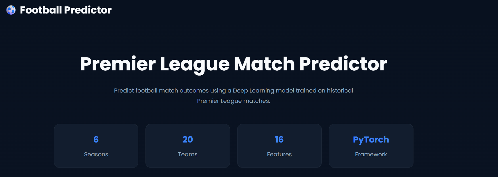
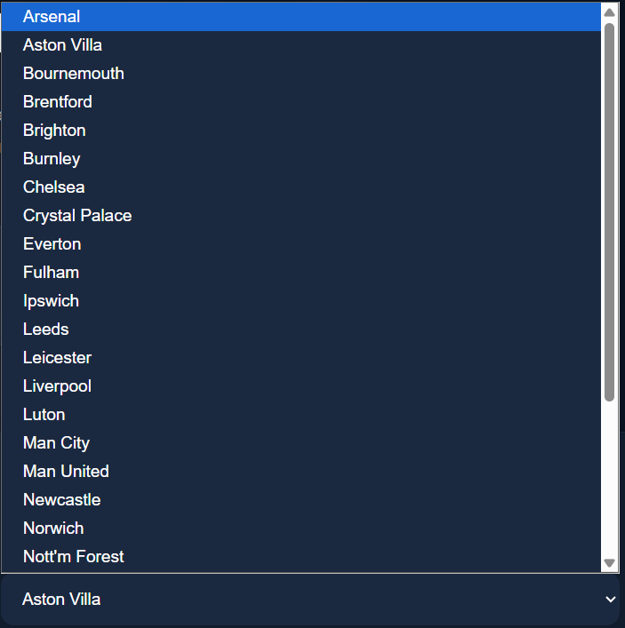
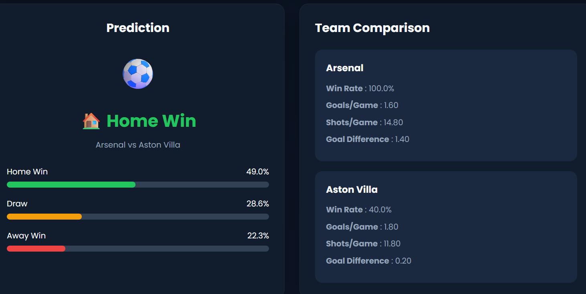
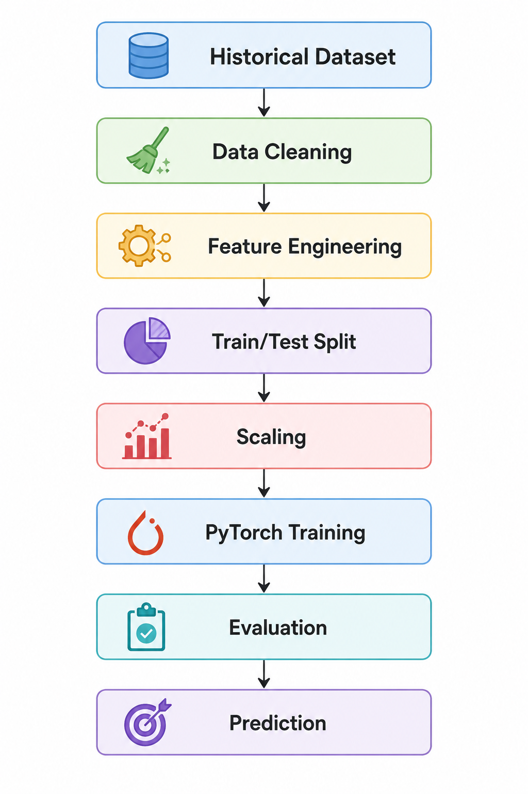
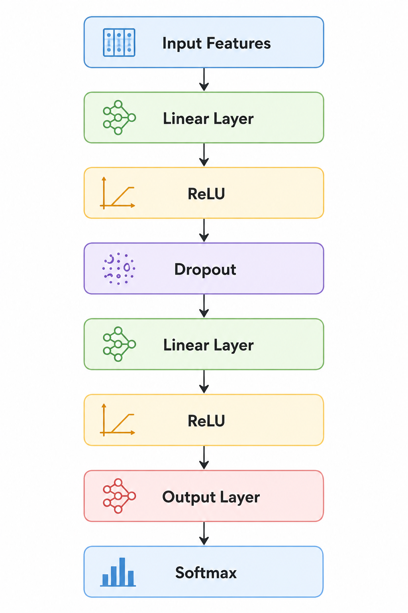
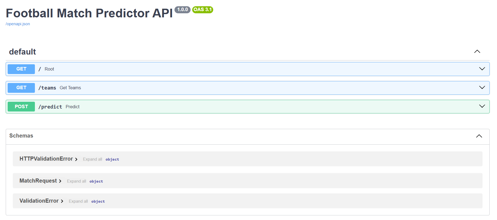

# ⚽ Football Match Outcome Predictor

<p align="center">


</p>

<p align="center">

A machine learning-powered web application that predicts the outcome of English Premier League football matches using historical match statistics, feature engineering, and a PyTorch neural network.

</p>

---

## 📖 Table of Contents

- Overview
- Features
- Project Preview
- Web Interface
- Model Pipeline
- Model Architecture
- Project Structure
- Feature Engineering
- Training Results
- REST API
- Installation
- Usage
- Technologies Used
- Future Improvements
- Author

---

# 📌 Overview

Predicting football match outcomes is a challenging machine learning task due to the dynamic nature of team performance, home advantage, player form, and historical statistics.

This project builds an end-to-end prediction system that combines:

- Historical Premier League match data
- Feature engineering using recent team performance
- Data preprocessing with StandardScaler
- A PyTorch feedforward neural network
- FastAPI backend
- Interactive HTML/CSS/JavaScript frontend

The application predicts one of three possible outcomes:

- 🟢 Home Win
- 🟡 Draw
- 🔴 Away Win

along with the probability of each outcome.

---

# ✨ Features

- ⚽ Predict Premier League match outcomes
- 🧠 PyTorch Neural Network classifier
- 📊 Feature engineering from historical match statistics
- 📈 Probability distribution for all three outcomes
- 🌐 FastAPI backend REST API
- 💻 Interactive web interface
- 📁 Modular project structure
- 🚀 Easy local deployment

- ---

# 📸 Project Preview

## 🏠 Home Page

The application provides a clean and intuitive interface for selecting two Premier League teams and predicting the match outcome.

<p align="center">

</p>

---

## ⚽ Match Prediction

Select the **Home Team** and **Away Team**, then click **Predict Match** to generate the prediction.

<p align="center">

</p>

---

## 📊 Prediction Result

The model predicts one of three possible outcomes and provides confidence scores for each class.

<p align="center">

</p>

Example Output

| Outcome | Probability |
|----------|------------:|
| 🟢 Home Win | 64.8% |
| 🟡 Draw | 21.3% |
| 🔴 Away Win | 13.9% |

The interface also displays a comparison of both teams using their historical statistics, allowing users to understand the reasoning behind the prediction.


# 🌐 Web Interface

The frontend is built using **HTML**, **CSS**, and **JavaScript**, while predictions are served through a **FastAPI** backend.

### Main Features

- Modern responsive interface
- Team selection using dropdown menus
- Real-time prediction requests
- Probability visualization
- Team statistics comparison
- Clean card-based layout
- Error handling for invalid selections


## 🖥️ Application Workflow

```text
User selects Home Team
            │
            ▼
User selects Away Team
            │
            ▼
Click Predict
            │
            ▼
FastAPI receives request
            │
            ▼
Model loads saved scaler
            │
            ▼
Features are generated
            │
            ▼
PyTorch model predicts outcome
            │
            ▼
Probabilities returned to frontend
            │
            ▼
Prediction displayed to user

---


# 🧠 Machine Learning Pipeline

This project follows a complete end-to-end machine learning workflow, beginning with historical Premier League match data and ending with real-time match outcome predictions through a web application.

<p align="center">

</p>

The prediction workflow consists of the following stages:

1. Historical match data collection
2. Data cleaning and preprocessing
3. Feature engineering
4. Feature scaling
5. Neural network training
6. Model evaluation
7. Model serialization
8. Real-time prediction through FastAPI

---

# 🏗️ Model Architecture

The prediction model is implemented using **PyTorch** as a fully connected feedforward neural network.

<p align="center">

</p>

### Network Architecture

```text
Input Features
      │
      ▼
Linear Layer
      │
      ▼
ReLU Activation
      │
      ▼
Dropout
      │
      ▼
Linear Layer
      │
      ▼
ReLU Activation
      │
      ▼
Output Layer
      │
      ▼
Softmax Probabilities
```

The model outputs probabilities for the three possible match outcomes:

- 🟢 Home Win
- 🟡 Draw
- 🔴 Away Win

---

# ⚙️ Prediction Pipeline

Every prediction follows the same sequence:

```text
User Input
     │
     ▼
Team Statistics Generated
     │
     ▼
Feature Vector Created
     │
     ▼
StandardScaler Transformation
     │
     ▼
PyTorch Neural Network
     │
     ▼
Probability Calculation
     │
     ▼
Predicted Match Outcome
```

This ensures that the preprocessing performed during inference is identical to the preprocessing used during training.

---

# 📊 Feature Engineering

Rather than directly feeding raw match data into the neural network, the project generates meaningful statistical features representing each team's recent performance.

### Engineered Features

| Feature | Description |
|----------|-------------|
| Win Rate | Percentage of matches won |
| Draw Rate | Percentage of drawn matches |
| Loss Rate | Percentage of matches lost |
| Average Goals Scored | Mean goals scored over recent matches |
| Average Goals Conceded | Mean goals conceded |
| Goal Difference | Goals scored − goals conceded |
| Average Shots | Average shots per game |
| Shots on Target | Average shots on target |
| Home Form | Recent performance at home |
| Away Form | Recent away performance |
| Points per Match | Average league points earned |
| Last N Match Form | Rolling form from recent fixtures |

These engineered features provide significantly more predictive information than raw historical match records.

---

# 🗂️ Data Flow

```text
Historical Match Data
          │
          ▼
Data Cleaning
          │
          ▼
Feature Engineering
          │
          ▼
Training Dataset
          │
          ▼
Feature Scaling
          │
          ▼
Neural Network Training
          │
          ▼
Saved Model (.pth)
          │
          ▼
Prediction API
          │
          ▼
Frontend
```

---

# 💾 Saved Model

After training, the project stores:

- Trained PyTorch model (`.pth`)
- StandardScaler
- Label encoder
- Feature configuration

These saved artifacts allow predictions to be performed instantly without retraining the model.

---
---

# 📂 Project Structure

The project follows a modular architecture that separates data processing, model training, backend services, and the web interface.

```text
football-match-predictor/
│
├── api/                # FastAPI backend
├── data/               # Historical datasets
├── models/             # Saved model & scaler
├── notebooks/          # Exploratory data analysis
├── src/                # Training & prediction modules
├── web/                # Frontend (HTML/CSS/JS)
├── assets/             # Images used in README
├── requirements.txt
└── README.md
```

### Folder Description

| Folder | Description |
|---------|-------------|
| **api/** | FastAPI backend exposing prediction endpoints |
| **src/** | Feature engineering, model training, prediction, and utility modules |
| **data/** | Raw and processed Premier League datasets |
| **models/** | Saved PyTorch model, scaler, and label encoder |
| **notebooks/** | Data exploration, visualization, and experimentation |
| **web/** | Frontend built with HTML, CSS, and JavaScript |
| **assets/** | README images, diagrams, and screenshots |

---

#  Model Evaluation

The trained neural network is evaluated on a held-out test dataset to measure its ability to generalize to unseen matches.

The project evaluates predictions using standard machine learning metrics such as:

- Accuracy
- Precision
- Recall
- F1 Score

These metrics can be generated after training to assess the effectiveness of the feature engineering and neural network architecture.

> **Note:** This repository focuses on providing an end-to-end prediction system, including data preprocessing, model training, API development, and an interactive web interface.

# ⚡ REST API

Predictions are served through a FastAPI backend.

## Predict Match

**Endpoint**

```http
POST /predict
```

### Request

```json
{
    "home_team": "Arsenal",
    "away_team": "Chelsea"
}
```

### Response

```json
{
    "prediction": "Home Win",
    "probabilities": {
        "Home Win": 0.648,
        "Draw": 0.213,
        "Away Win": 0.139
    }
}
```

---

## Interactive API Documentation

FastAPI automatically generates Swagger documentation.

<p align="center">

</p>

After starting the backend, visit:

```text
http://localhost:8000/docs
```

to test the API directly from your browser.

---

# 🔄 End-to-End Prediction Flow

```text
Frontend
    │
    ▼
FastAPI Backend
    │
    ▼
Generate Features
    │
    ▼
Load StandardScaler
    │
    ▼
Transform Features
    │
    ▼
Load PyTorch Model
    │
    ▼
Predict Outcome
    │
    ▼
Return JSON Response
    │
    ▼
Display Prediction
```

---
---

# 🚀 Installation

Clone the repository

```bash
git clone https://github.com/Tallashreyas/football-match-predictor.git
cd football-match-predictor
```

Create a virtual environment

```bash
python -m venv .venv
```

Activate it

### Windows

```bash
.venv\Scripts\activate
```

### Linux / macOS

```bash
source .venv/bin/activate
```

Install the required dependencies

```bash
pip install -r requirements.txt
```

---

# ▶️ Running the Project

## Start the FastAPI backend

```bash
cd api
uvicorn app:app --reload
```

The backend will be available at

```text
http://localhost:8000
```

Interactive API documentation

```text
http://localhost:8000/docs
```

---

## Start the Frontend

Open

```text
web/index.html
```

in your browser.

Alternatively, serve it using a local HTTP server.

---

# 💻 Technologies Used

| Category | Technology |
|----------|------------|
| Programming Language | Python |
| Machine Learning | PyTorch |
| Backend | FastAPI |
| Frontend | HTML, CSS, JavaScript |
| Data Processing | NumPy, Pandas |
| Feature Scaling | scikit-learn |
| Visualization | Matplotlib |
| API Testing | Swagger UI |
| Version Control | Git & GitHub |

---

# 🚀 Future Improvements

There are several opportunities to extend this project:

- Support additional football leagues
- Integrate live football APIs for real-time data
- Include player injuries and squad availability
- Add expected goals (xG) and possession-based features
- Improve prediction explainability using SHAP or feature importance analysis
- Train deeper neural network architectures
- Dockerize the application
- Deploy the project online using Render or Railway
- Add user authentication and prediction history
- Compare multiple machine learning models (Random Forest, XGBoost, LightGBM)

---

# 🤝 Contributing

Contributions, feature suggestions, and bug reports are welcome.

If you have ideas for improving the project, feel free to fork the repository and submit a pull request.

---

# 📄 License

This project is licensed under the MIT License.

---

# 👨‍💻 Author

**Talla Shreyas**

Engineering Science Undergraduate • IIT Hyderabad

Passionate about Machine Learning, Artificial Intelligence, Backend Development, and Building Real-World AI Applications.

If you found this project helpful, consider giving it a ⭐ on GitHub!

---